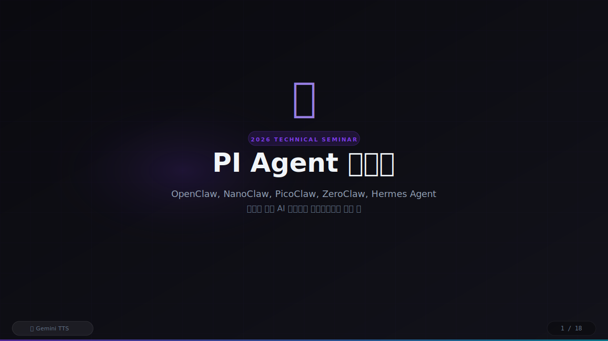
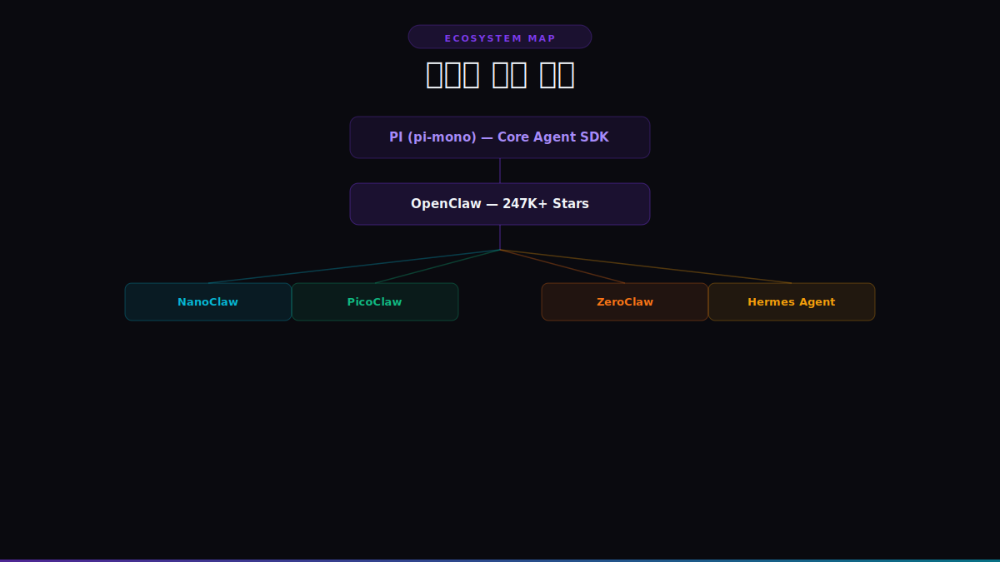
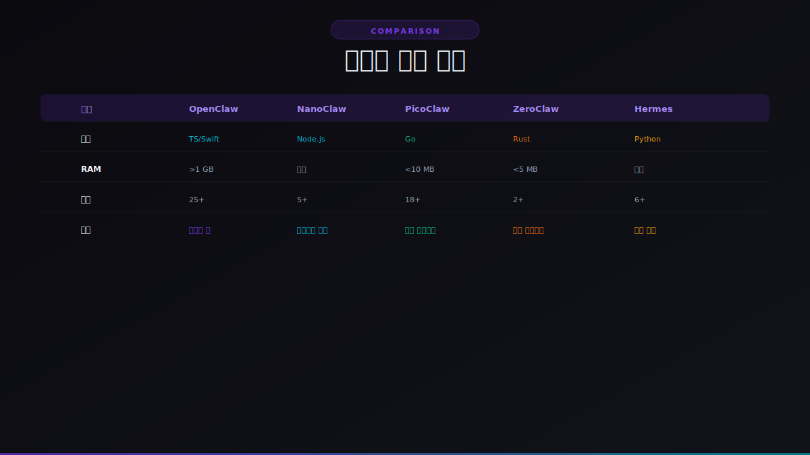

# PI Agent 생태계 세미나

> OpenClaw / NanoClaw / PicoClaw / ZeroClaw / Hermes Agent
> 차세대 개인 AI 에이전트 프레임워크의 모든 것



## 개요

PI Agent 생태계를 소개하는 **18슬라이드 인터랙티브 세미나 발표 자료**입니다.

- **Gemini 2.5 Flash TTS** 고품질 한국어 음성 나레이션
- 시작 버튼 클릭 시 자동 음성 재생 + 슬라이드 전환
- 키보드 네비게이션 + 일시정지/재개 지원
- Web Speech API 자동 폴백

## 미리보기

### 생태계 계층 구조


### 프레임워크 종합 비교


## 다루는 내용

| Part | 주제 |
|------|------|
| **1** | PI Agent 개념, SDK 아키텍처 (pi-ai, pi-agent-core, pi-coding-agent, pi-tui) |
| **2** | OpenClaw (247K+ Stars, 25+ 채널, 5,700+ 스킬) |
| **3** | NanoClaw (컨테이너 격리), PicoClaw (Go, $10 하드웨어), ZeroClaw (Rust, <5MB) |
| **4** | Hermes Agent (자기 학습 루프, Nous Research) |
| **5** | 생태계 비교, 상호운용성 표준, 프레임워크 선택 가이드, 설치 방법 |

## 빠른 시작

```bash
# 1. 클론
git clone https://github.com/JEO-tech-ai/pi-agent-seminar.git
cd pi-agent-seminar

# 2. 브라우저에서 열기
open presentation.html
# 또는: xdg-open presentation.html (Linux)

# 3. 재생 버튼(▶) 클릭 → 자동 발표 시작!
```

## 조작법

| 키 | 기능 |
|----|------|
| `Enter` | 발표 시작 |
| `Space` | 일시정지 / 재개 |
| `→` `PageDown` | 다음 슬라이드 |
| `←` `PageUp` | 이전 슬라이드 |
| `Escape` | 발표 중단 |

## TTS 음성 재생성

Gemini API 키가 있으면 음성을 재생성할 수 있습니다:

```bash
npm install
GEMINI_API_KEY=your-key node generate-audio.js
```

- **모델**: Gemini 2.5 Flash TTS
- **음성**: Kore (여성, 전문적 톤)
- **출력**: `audio/slide-00.wav` ~ `slide-17.wav`

## 파일 구조

```
pi-agent-seminar/
├── presentation.html    # 메인 프레젠테이션 (단일 HTML)
├── generate-audio.js    # Gemini TTS 오디오 생성 스크립트
├── GUIDE.md             # 상세 사용 가이드
├── audio/               # Gemini TTS 생성 WAV 파일 (18개)
│   ├── slide-00.wav
│   ├── ...
│   └── slide-17.wav
└── images/              # README 미리보기 이미지
```

## 기술 스택

- **프레젠테이션**: HTML5 / CSS3 (Glass Morphism, CSS Grid, Animations)
- **TTS**: Gemini 2.5 Flash TTS (Kore voice, ko-KR)
- **오디오**: Web Audio API, Web Speech API (폴백)
- **디자인**: 다크 테마, 보라/시안 그라데이션, Claw 브랜딩
- **의존성 없음**: 외부 프레임워크 없이 순수 HTML/CSS/JS

## 라이선스

MIT
